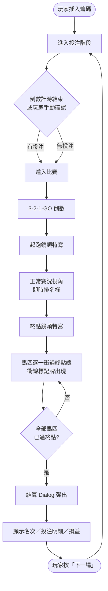
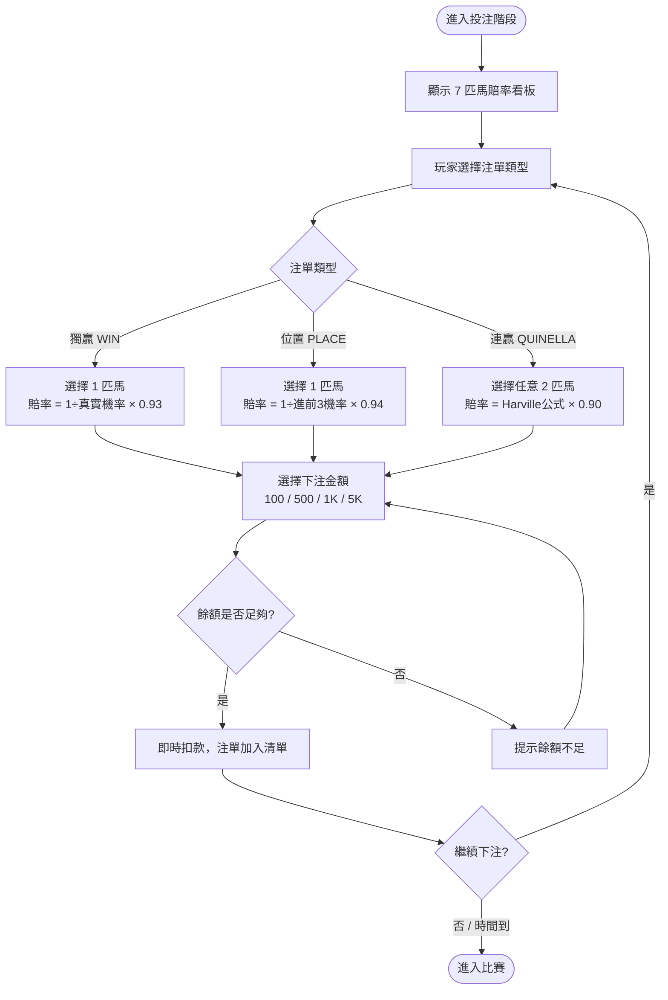
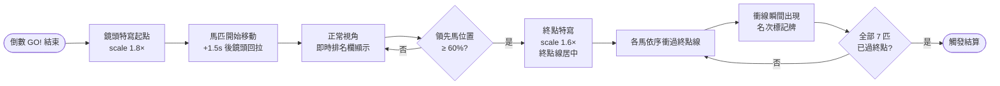

# 賽馬街機系統企劃書

---

# 目的

1. **概要**：單人賽馬街機台，玩家對 7 匹馬下注獨贏、位置或連贏，觀看視差捲軸動畫比賽，依賠率結算彩金。
2. **目標**：
   - 打造 TA（40–50 歲）熟悉的賽馬博弈體驗，降低學習門檻
   - 透過流暢的視覺演出（起跑縮放、終點特寫、衝線標記）強化刺激感與留台意願
   - 以 RTP 91–94% 確保長期莊家優勢，同時讓玩家感受高頻中注
3. **做法**：
   - 前端以 HTML/CSS/JS Prototype 驗證核心玩法與視覺演出
   - Harville 公式將真實機率與顯示賠率解耦，獨立控制 RTP
   - 視差六層捲軸模擬 2D 賽道深度，搭配三段鏡頭（起跑特寫→正常→終點特寫）

---

# 流程圖

## 流程一：整體遊戲迴圈

## 流程二：投注操作流程

## 流程三：比賽視覺演出流程

---

# 結構

## 主介面

| 區塊 | 說明 |
|------|------|
| **賠率看板（Tote Board）** | 7 匹馬 × 3 種注單（獨贏／位置／連贏），每格顯示馬名、顏色、賠率 |
| **籌碼欄** | 目前餘額、本場下注記錄 |
| **倒數計時條** | 投注剩餘秒數，≤10s 轉紅色閃爍 |
| **投注操作列** | 金額按鈕（100/500/1K/5K）、白銀開放、白金開放（高額注）、黃金壓注、確認下注 |
| **歷史紀錄** | 近 50 場排名紀錄、馬匹統計（可展開） |

## 主功能

### 1. 投注系統
- 三種注單類型：獨贏（WIN）、位置（PLACE）、連贏（QUINELLA）
- 點擊格子即刻扣款（骰寶式），支援同一格多次追加
- 同場可同時持有多張不同類型注單

### 2. 跑馬動畫
- 6 層視差背景（天空/看台/廣告板/圍欄/跑道/草叢）
- 7 匹馬獨立賽道，速度由預先抽定名次決定
- 落後馬（第 4–7 名）在賽中觸發技能氣泡（純視覺演出）
- 即時排名欄（左側），500ms 節流更新升降箭頭

### 3. 三段鏡頭系統
| 階段 | 觸發條件 | 效果 |
|------|----------|------|
| 起跑特寫 | GO! 瞬間 | scale 1.8×，聚焦起點（x≈8%） |
| 正常視角 | GO! + 1.5s | 回拉至正常，排名欄顯示 |
| 終點特寫 | 領先馬位置 ≥ 60% | scale 1.6×，終點線居中（x≈92%） |

### 4. 衝線標記牌
- 每匹馬越過終點線瞬間，在所在賽道留下固定標記牌
- 顯示：名次（1st/2nd/3rd…）、號碼圓圈、馬名
- 1–3 名顯示金/銀/銅色，4–7 名顯示馬匹本色

### 5. 結算 Dialog
- 全部 7 匹馬過線後彈出
- 內容：前三名頒獎台、投注明細列表（含中注/未中）、總投注/總派彩/淨損益
- 底部「下一場 →」按鈕回到投注階段

## 副功能

### 黃金馬機制
- 每場從 7 匹中隨機指定 1 匹為「黃金馬」
- 玩家可手動指定黃金馬（需輸入目標顯示賠率）
- 黃金馬在賠率看板顯示金色外框，跑馬時有金色光暈
- 機率調整：黃金馬真實機率 = 1 ÷ 指定賠率，其餘馬按比例重分配

### 歷史紀錄
- 近 50 場排名結果，可切換「排名紀錄」與「馬匹統計」兩個 Tab
- 馬匹統計顯示每匹馬的累計勝率、前三率

---

# 呈現

## 美術風格

- **主色調**：深夜暗藍（`#071320`）+ 黃金（`#c9a227`）
- **主題**：夜間賽馬場，燈光璀璨
- **風格**：2D 精緻插畫，馬匹有擬人化表情，強調華麗感而非寫實
- **目標感受**：「高級賽馬俱樂部」，有別於傳統街機的廉價感
- **參考方向**：香港夜間賽馬場、Gold/Black 配色的奢華賭場

## 各介面說明

### 投注介面
- 看板格子：底色 `#111827`，選中格子金色邊框＋淡金背景
- 賠率數字以等寬字型顯示，大字突出
- 每匹馬有專屬顏色圓點識別（7 色：黃/紅/藍/綠/橙/紫/青）
- 黃金馬格子：金色邊框 + 皇冠圖示 ♔

### 跑馬介面
- 天空：深藍漸層 + 星星粒子
- 看台：剪影輪廓，22s 慢速捲動（最遠層）
- 廣告板：11s 捲動，顯示贊助商文字
- 圍欄：木製樁柱，4.5s 捲動
- 跑道：深棕泥土（`#8a6035` → `#442a12`），水平賽道紋路
- 草叢：底部小三角草叢，2s 最快捲動（最近層）

### 倒數介面
- 大數字（3/2/1）配黃金圓形進度環，環在 0.93s 內填滿
- GO! 以綠色大字彈跳出現後淡出

### 結算 Dialog
- 半透明黑色 backdrop + 毛玻璃效果
- 頒獎台：🥇🥈🥉 顯示前三名馬匹顏色與名稱
- 明細列表：WIN/PLACE/QUINELLA 標籤色分類，中注列高亮綠色背景
- 損益數字：盈利綠色、虧損紅色

---

# 規則

## 1. 馬匹設定
a. 每場固定 7 匹馬參賽
b. 真實機率權重預設為 `[30, 22, 16, 12, 9, 7, 4]`（可後台調整）
c. 黃金馬每場隨機指派 1 匹，或由玩家手動設定
d. 各馬顯示賠率由 Harville 公式計算，加入 ±2% 隨機噪音

## 2. 注單類型與 RTP

| 類型 | 玩法說明 | RTP 目標 |
|------|----------|----------|
| **獨贏（WIN）** | 選 1 匹馬，猜測第 1 名 | 93% |
| **位置（PLACE）** | 選 1 匹馬，猜測進前 3 名 | 94% |
| **連贏（QUINELLA）** | 選 2 匹馬，猜測包辦第 1、2 名（順序不限）| 90% |

a. 賠率公式：`顯示賠率 = (1 ÷ 真實機率) × RTP目標 × noise(0.98–1.02)`
b. 連贏賠率使用 Harville 公式：`P(A,B) = P(A)×P(B)/(1-P(A)) + P(B)×P(A)/(1-P(B))`
c. 玩家看到的賠率與真實機率脫鉤，不影響比賽結果
d. 整體 RTP 加權約 91–93%

## 3. 投注規則
a. 每場投注期間由倒數計時條控制（預設 30 秒）
b. 點擊格子即刻扣除籌碼（骰寶式，非確認後扣款）
c. 同一格可重複點擊，累計注額
d. 倒數結束後自動進入比賽，不論是否有投注
e. 餘額不足時無法繼續下注，不提供借貸功能

## 4. 比賽規則
a. 比賽結果由 Harville 序列抽樣預先決定，與視覺動畫無關
b. 各馬速度依名次分配（第 1 名最快），再加小幅隨機噪音（±6%）
c. 速度比例：`[1.00, 0.92, 0.84, 0.77, 0.71, 0.66, 0.62]`（可調整）
d. 比賽總時長：領先馬約 9 秒到達終點
e. 落後馬（第 4–7 名）在賽中 20–73% 時段隨機觸發技能氣泡（純視覺）

## 5. 結算規則
a. 全部 7 匹馬越過終點線後才觸發結算
b. 派彩 = 投注金額 × 顯示賠率
c. 派彩即時加回玩家餘額
d. 中注條件：
   - 獨贏：選中的馬為第 1 名
   - 位置：選中的馬為前 3 名之一
   - 連贏：選中的 2 匹馬包辦第 1、2 名（順序不限）

---

# 設定

## 數值參數（可後台調整）

| 參數名稱 | 預設值 | 說明 |
|----------|--------|------|
| `RTP_WIN` | 0.93 | 獨贏 RTP |
| `RTP_PLACE` | 0.94 | 位置 RTP |
| `RTP_QUINELLA` | 0.90 | 連贏 RTP |
| `RACE_DUR` | 9000ms | 領先馬到達終點時間 |
| `BETTING_TIME` | 30s | 每場投注倒數秒數 |
| `TRUE_PROB_WEIGHTS` | [30,22,16,12,9,7,4] | 7 匹馬真實機率權重 |
| `SPEED_BY_RANK` | [1.00,0.92,0.84,0.77,0.71,0.66,0.62] | 各名次速度比例 |
| `FINISH_ZOOM_TRIGGER` | 60% | 終點特寫觸發位置 |

## 埋點建議

| 事件名稱 | 觸發時機 | 記錄欄位 |
|----------|----------|----------|
| `bet_placed` | 玩家點擊格子 | type / horse_pos / amount / odds |
| `race_started` | 比賽啟動 | race_num / golden_pos / order（預先結果）|
| `race_finished` | 全部馬過終點 | winner_pos / race_duration |
| `payout_settled` | 結算完成 | total_bet / total_payout / net / rtp |
| `session_end` | 玩家離台 | total_races / total_bet / total_net |

---

# 後台

| 功能 | 說明 |
|------|------|
| **RTP 設定** | 分別調整 WIN / PLACE / QUINELLA 的 RTP 目標值 |
| **機率權重設定** | 調整 7 匹馬的真實機率權重分配 |
| **比賽時長設定** | 調整 RACE_DUR（影響整體比賽節奏）|
| **投注時限設定** | 調整每場倒數秒數 |
| **場次記錄查詢** | 查詢每場比賽結果、投注記錄、RTP 實績 |
| **黃金馬設定** | 設定預設黃金馬，或開放玩家自選 |

---

# 調整紀錄

（上線後填入）

---

> 文件版本：v0.1 Prototype｜2026-04-22  
> 負責人：ben.lin
